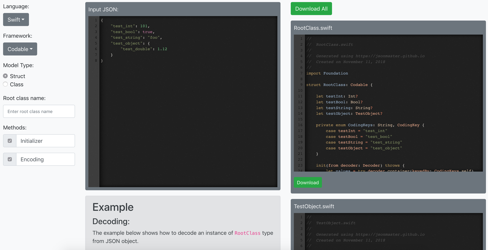

# JSON Master

Visit: https://jsonmaster.github.io

### Supported Languages and Frameworks:

1. **[Swift](https://swift.org/getting-started/)**
    - [Codable](https://developer.apple.com/documentation/foundation/archives_and_serialization/using_json_with_custom_types)
    - [SwiftyJSON](https://github.com/SwiftyJSON/SwiftyJSON)
    - [Swift Dictionary](https://developer.apple.com/swift/blog/?id=37)
2. **[Java](https://docs.oracle.com/en/java/javase/11/)**
    - [Gson](https://github.com/google/gson)
    - [Moshi](https://github.com/square/moshi)
    - [Android/JSONObject](https://developer.android.com/reference/org/json/JSONObject)
3. **[Kotlin](https://kotlinlang.org/docs/reference/)**
    - [Gson](https://github.com/google/gson)
    - [Moshi](https://github.com/square/moshi#kotlin)
4. **[C#](https://docs.microsoft.com/en-us/dotnet/csharp/)**
    - [Newtonsoft](https://www.newtonsoft.com/json/help/html/SerializingJSON.htm)
    - C# Class
    
4. **[X++](https://docs.microsoft.com/en-us/dynamics365/fin-ops-core/dev-itpro/dev-ref/xpp-language-reference)**
    - [Newtonsoft](https://www.newtonsoft.com/json/help/html/SerializingJSON.htm)
    - C# Class